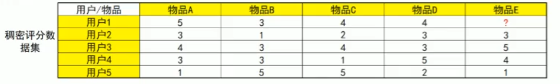

# 协同过滤推荐算法（Collaborate Filtering）

算法思想：**物以类聚（item），人以群分（user）**

基本的协同过滤推荐算法基于以下假设：

- “跟你喜好**相似的人**喜欢的东子你也很可能喜欢”：基于用户的协同过滤推荐（User-based CF）
- "跟你喜欢的东西**相似的东西**你也可能喜欢"：基于物品的协同过滤推荐（Item-based CF）

实现协同过滤推荐有以下几个步骤：

1. **找出最相似的人或物品：Top-N相似的人或物品**

   通过计算两两的相似度来进行排序，即可找出Top-N相似的人或物品

2. **根据相似的人或物品产生推荐结果**

   利用Top-N结果生成初始推荐结果，然后过滤掉用户已经有过记录的物品或明确表示不感兴趣的物品

如果买/没买，点/没点，可以使用jaccard系数

一般用评分去做协同过滤，可以使用皮尔逊相关系数

# 协同过滤推荐算法代码实现

## 1. 根据购买情况，为每个用户推荐商品（Jaccard）

```python
import numpy as np
import pandas as pd
from sklearn.metrics.pairwise import pairwise_distances


class CollaborateFiltering(object):
    def __init__(self, user, item, data):
        self.users = user
        self.items = item
        self.dataset = data

    def df_dataset(self):
        self.dataset = np.where(np.isin(self.dataset, ['buy']), np.array([1]), self.dataset)
        self.dataset = np.where(np.isin(self.dataset, [None]), np.array([0]), self.dataset)
        self.dataset = pd.DataFrame(self.dataset, index=self.users, columns=self.items)
        return self.dataset

    def calculate_user_similarity(self, df):
        user_similarity = 1 - pairwise_distances(np.array(df), metric='jaccard')
        user_similarity = pd.DataFrame(user_similarity, index=self.users, columns=self.users)
        return user_similarity

    def calculate_item_similarity(self, df):
        item_similarity = 1 - pairwise_distances(np.array(df).T, metric='jaccard')
        item_similarity = pd.DataFrame(item_similarity, index=self.items, columns=self.items)
        return item_similarity

    def user_basedcf(self, user_sim):
        top2_users = {}
        for i in user_sim.index:
            _df = user_sim.loc[i].drop([i])
            _df_sorted = _df.sort_values(ascending=False)
            top2 = list(_df_sorted.index[:2])
            top2_users[i] = top2
        user_basedcf_results = {}
        for user, sim_users in top2_users.items():
            user_basedcf_result = set()
            for sim_user in sim_users:
                user_basedcf_result = user_basedcf_result.union(
                    set(self.dataset.loc[sim_user].replace(0, np.nan).dropna().index))
            user_basedcf_result -= set(self.dataset.loc[user].replace(0, np.nan).dropna().index)
            user_basedcf_results[user] = user_basedcf_result
        return user_basedcf_results

    def item_basedcf(self, item_sim):
        top2_items = {}
        for i in item_sim.index:
            _df = item_sim.loc[i].drop([i])
            _df_sorted = _df.sort_values(ascending=False)
            top2 = list(_df_sorted.index[:2])
            top2_items[i] = top2
        item_basedcf_results = {}
        for user in self.dataset.index:
            item_basedcf_result = set()
            for item in self.dataset.loc[user].replace(0, np.nan).dropna().index:
                item_basedcf_result = item_basedcf_result.union(set(top2_items[item]))
            item_basedcf_result -= set(self.dataset.loc[user].replace(0, np.nan).dropna().index)
            item_basedcf_results[user] = item_basedcf_result
        return item_basedcf_results


users = ['User1', 'User2', 'User3', 'User4', 'User5']
items = ['ItemA', 'ItemB', 'ItemC', 'ItemD', 'ItemE']
dataset = [["buy", None, "buy", "buy", None],
           ["buy", None, None, "buy", "buy"],
           ["buy", None, "buy", None, None],
           [None, "buy", None, "buy", "buy"],
           ["buy", "buy", "buy", None, "buy"]]

model = CollaborateFiltering(user=users, item=items, data=dataset)

# 基于用户的协同过滤推荐（User-based CF）
dataset = model.df_dataset()
user_Similarity = model.calculate_user_similarity(dataset)
user_basedcf = model.user_basedcf(user_Similarity)
print(user_basedcf)

# 基于物品的协同过滤推荐（Item-based CF）
item_Similarity = model.calculate_item_similarity(dataset)
item_basedcf = model.item_basedcf(item_Similarity)
print(item_basedcf)
```

## 2. 根据其他连续数据，预测用户对商品的感兴趣程度（皮尔逊系数）

使用协同过滤推荐算法对用户进行评分预测

- **数据集**

- **评分预测**

  **User-Based CF 评分预测：使用用户间的相似度进行预测**

  考虑用户本身的评分以及近邻用户的加权平均相似度打分来进行预测：
  $$
  pred(u,i)=\hat{r}_{ui}=\cfrac{\sum_{v\in U}sim(u,v)*r_{vi}}{\sum_{v\in U}|sim(u,v)|}
  $$
  预测用户1对物品E的评分，可以根据用户1最近邻的用户2和用户3进行预测，计算如下：
  $$
  pred(u_1, i_5) =\cfrac{0.85*3+0.71*5}{0.85+0.71} = 3.91
  $$
  **Item-Based CF 评分预测：使用物品间的相似度进行预测**

  利用物品相似度预测如上，同样考虑了用户自身的平均打分因素，结合预测物品与相似物品的加权相似度打分进行预测
  $$
   pred(u,i)=\hat{r}_{ui}=\cfrac{\sum_{j\in I_{rated}}sim(i,j)*r_{uj}}{\sum_{j\in I_{rated}}sim(i,j)}
  $$
  测用户1对物品E的评分，那么可以根据与物品E最近邻的物品A和物品D进行预测，计算如下：
  $$
  pred(u_1, i_5) = \cfrac {0.97*5+0.58*4}{0.97+0.58} = 4.63
  $$
  对比可见，User-Based CF预测评分和Item-Based CF的评分结果也是存在差异的，因为严格意义上他们其实应当属于两种不同的推荐算法，各自在不同的领域不同场景下，都会比另一种的效果更佳，但具体哪一种更佳，必须经过合理的效果评估，因此在实现推荐系统时这两种算法往往都是需要去实现的，然后对产生的推荐效果进行评估分析选出更优方案。

```python
import pandas as pd


class CollaborateFilteringPearson(object):
    def __init__(self, user, item, data):
        self.users = user
        self.items = item
        self.dataset = pd.DataFrame(data, index=self.users, columns=self.items)

    def predict_user_based_score(self, given_user, given_item):
        user_similarity = self.dataset.T.corr().round(4)
        top2_users = {}
        for i in user_similarity.index:
            _df = user_similarity.loc[i].drop([i])
            _df_sorted = _df.sort_values(ascending=False)
            top2 = list(_df_sorted.index[:2])
            top2_users[i] = top2
        sim_users = top2_users[given_user]
        score, abs_sum = 0, 0
        for sim_user in sim_users:
            score += user_similarity.loc[given_user, sim_user] * self.dataset.loc[sim_user, given_item]
            abs_sum += user_similarity.loc[given_user, sim_user]
        return score / abs_sum

    def predict_item_based_score(self, given_user, given_item):
        item_similarity = self.dataset.corr().round(4)
        top2_items = {}
        for i in item_similarity.index:
            _df = item_similarity.loc[i].drop([i])
            _df_sorted = _df.sort_values(ascending=False)
            top2 = list(_df_sorted.index[:2])
            top2_items[i] = top2
        sim_items = top2_items[given_item]
        score, item_sum = 0, 0
        for sim_item in sim_items:
            score += item_similarity.loc[sim_item, given_item] * self.dataset.loc[given_user, sim_item]
            item_sum += item_similarity.loc[sim_item, given_item]
        return score / item_sum


users = ['User1', 'User2', 'User3', 'User4', 'User5']
items = ['ItemA', 'ItemB', 'ItemC', 'ItemD', 'ItemE']
datasets = [
    [5, 3, 4, 4, None],
    [3, 1, 2, 3, 3],
    [4, 3, 4, 3, 5],
    [3, 3, 1, 5, 4],
    [1, 5, 5, 2, 1],
]
pre_user = 'User1'
pre_item = 'ItemE'

model = CollaborateFilteringPearson(users, items, datasets)
predict_score_ub = model.predict_user_based_score(pre_user, pre_item)
print(predict_score_ub)

predict_score_ib = model.predict_item_based_score(pre_user, pre_item)
print(predict_score_ib)
```

