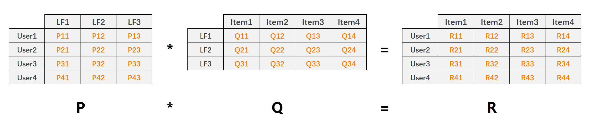
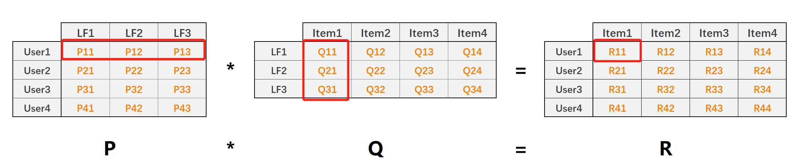

# LFM算法原理及代码实现

## 1. LFM原理解析

LFM(latent factor model)隐语义模型核心思想是**通过隐含特征联系用户和物品**，如下图：



- P矩阵是**User-LF**矩阵，即**用户和隐含特征矩阵**。LF有三个，表示总共有三个隐含特征。
- Q矩阵是**LF-Item**矩阵，即**隐含特征和物品的特征**。
- R矩阵是**User-Item**矩阵，由$P×Q$得来。
- 能处理稀疏评分矩阵

利用矩阵分解技术，将原始User-Item的评分矩阵（稠密/稀疏）分解为P和Q矩阵，然后利用$P×Q$还原出User-Item评分矩阵$R$。整个过程相当于降维处理，其中：

- 矩阵值$P_{11}$表示用户1对隐含特征1的权重值
- 矩阵值$Q_{11}$表示隐含特征1在物品1上的权重值
- 矩阵值$R_{11}$表示预测的用户1对物品1的评分，且$R_{11}=\vec{P_{1,k}}\cdot \vec{Q_{k,1}}$



利用LFM预测用户对物品的评分，$k$表示隐含特征数量：
$$
\begin{aligned}
\hat {r}_{ui} &=\vec {p_{uk}}\cdot \vec {q_{ik}}
\\&={\sum_{k=1}}^k p_{uk}q_{ik}
\end{aligned}
$$
因此最终目标就是要求出P矩阵和Q矩阵及其当中的每一个值，然后再对用户-物品的评分进行预测。

## 2. 损失函数

同样对于评分预测利用平方差来构建损失函数：
$$
\begin{aligned}
Cost &= \sum_{u,i\in R} (r_{ui}-\hat{r}_{ui})^2
\\&=\sum_{u,i\in R} (r_{ui}-{\sum_{k=1}}^k p_{uk}q_{ik})^2
\end{aligned}
$$
加入L2正则化：
$$
Cost = \sum_{u,i\in R} (r_{ui}-{\sum_{k=1}}^k p_{uk}q_{ik})^2 + \lambda(\sum_U{p_{uk}}^2+\sum_I{q_{ik}}^2)
$$
对损失函数求偏导：
$$
\begin{aligned}
\cfrac {\partial}{\partial p_{uk}}Cost &= \cfrac {\partial}{\partial p_{uk}}[\sum_{u,i\in R} (r_{ui}-{\sum_{k=1}}^k p_{uk}q_{ik})^2 + \lambda(\sum_U{p_{uk}}^2+\sum_I{q_{ik}}^2)]
\\&=2\sum_{u,i\in R} (r_{ui}-{\sum_{k=1}}^k p_{uk}q_{ik})(-q_{ik}) + 2\lambda p_{uk}
\\\\
\cfrac {\partial}{\partial q_{ik}}Cost &= \cfrac {\partial}{\partial q_{ik}}[\sum_{u,i\in R} (r_{ui}-{\sum_{k=1}}^k p_{uk}q_{ik})^2 + \lambda(\sum_U{p_{uk}}^2+\sum_I{q_{ik}}^2)]
\\&=2\sum_{u,i\in R} (r_{ui}-{\sum_{k=1}}^k p_{uk}q_{ik})(-p_{uk}) + 2\lambda q_{ik}
\end{aligned}
$$

### 2.1 随机梯度下降法优化

梯度下降更新参数$p_{uk}$：
$$
\begin{aligned}
p_{uk}&:=p_{uk} - \alpha\cfrac {\partial}{\partial p_{uk}}Cost
\\&:=p_{uk}-\alpha [2\sum_{u,i\in R} (r_{ui}-{\sum_{k=1}}^k p_{uk}q_{ik})(-q_{ik}) + 2\lambda p_{uk}]
\\&:=p_{uk}+\alpha [\sum_{u,i\in R} (r_{ui}-{\sum_{k=1}}^k p_{uk}q_{ik})q_{ik} - \lambda p_{uk}]
\end{aligned}
$$
 同理：
$$
\begin{aligned}
q_{ik}&:=q_{ik} + \alpha[\sum_{u,i\in R} (r_{ui}-{\sum_{k=1}}^k p_{uk}q_{ik})p_{uk} - \lambda q_{ik}]
\end{aligned}
$$
**随机梯度下降：** 向量乘法 每一个分量相乘 求和
$$
\begin{aligned}
&p_{uk}:=p_{uk}+\alpha [(r_{ui}-{\sum_{k=1}}^k p_{uk}q_{ik})q_{ik} - \lambda_1 p_{uk}]
\\&q_{ik}:=q_{ik} + \alpha[(r_{ui}-{\sum_{k=1}}^k p_{uk}q_{ik})p_{uk} - \lambda_2 q_{ik}]
\end{aligned}
$$
由于P矩阵和Q矩阵是两个不同的矩阵，通常分别采取不同的正则参数，如$\lambda_1$和$\lambda_2$。

###### 算法实现

```python
import pandas as pd
import numpy as np

class LFM(object):
    def __init__(self,alpha,reg_p,reg_q,number_LatentFactors=10,num_epochs=10,columns=["uid","iid","rating"]):
        self.alpha = alpha #学习率
        self.reg_p = reg_p #P矩阵正则
        self.reg_q = reg_q #Q矩阵正则
        self.number_LatentFactors = number_LatentFactors #隐式类别数量
        self.number_epochs = num_epochs #最大迭代次数
        self.columns = columns

    def fit(self,datasets):
        """
        训练数据集
        :param datasets: uid,iid,rating
        :return:
        """
        self.dataset = pd.DataFrame(datasets)
        self.user_ratings = datasets.groupby(self.columns[0]).agg([list])[[self.columns[1],self.columns[2]]]
        self.item_ratings = datasets.groupby(self.columns[1]).agg([list])[[self.columns[0],self.columns[2]]]
        self.globalMean = self.dataset[self.columns[2]].mean()
        self.P,self.Q = self.sgd()

    def _init_matrix(self):
        """
        初始化P和Q矩阵，同时设置为0-1之间的随机值作为初始值
        :return:
        """
        P = dict(zip(self.user_ratings.index,np.random.rand(len(self.user_ratings),self.number_LatentFactors).astype(np.float32)))
        Q = dict(zip(self.item_ratings.index,np.random.rand(len(self.item_ratings),self.number_LatentFactors).astype(np.float32)))
        return P,Q

    def sgd(self):
        """
        使用随机梯度下降优化
        :return:
        """
        P,Q = self._init_matrix()
        for i in range(self.number_epochs):
            print("iter%d"%i)
            error_list = []
            for uid,iid,r_ui in self.dataset.itertuples(index=False):
                v_pu = P[uid] #用户向量
                v_qi = Q[iid] #物品向量
                err = np.float32(r_ui-np.dot(v_pu,v_qi))
                v_pu += self.alpha * (err * v_qi - self.reg_p * v_pu)
                v_qi += self.alpha * (err * v_pu - self.reg_q * v_pu)
                P[uid] = v_pu
                Q[iid] = v_qi
                error_list.append(err**2)
            print(np.sqrt(np.mean(error_list)))
        return P,Q

    def predict(self,uid,iid):
        # 如果uid或iid不在，使用全局平均分作为预测结果返回
        if uid not in self.user_ratings.index or iid not in self.item_ratings.index:
            return self.globalMean
        p_u = self.P[uid]
        q_i = self.Q[iid]
        return np.dot(p_u,q_i)

    def test(self,testset):
        """预测测试集数据"""
        for uid,iid,real_rating in testset.itertuples(index=False):
            try:
                pred_rating = self.predict(uid,iid)
            except Exception as e:
                print(e)
            else:
                yield uid,iid,real_rating,pred_rating


if __name__=='__main__':
    dtype = [("userId",np.int32),('movieId',np.int32),('rating',np.float32)]
    dataset = pd.read_csv('ratings.csv',dtype=dict(dtype),usecols=range(3))
    lfm = LFM(0.02,0.01,0.01,10,15,['userId','movieId','rating'])
    lfm.fit(dataset)
    print(lfm.predict(1,1))
```

